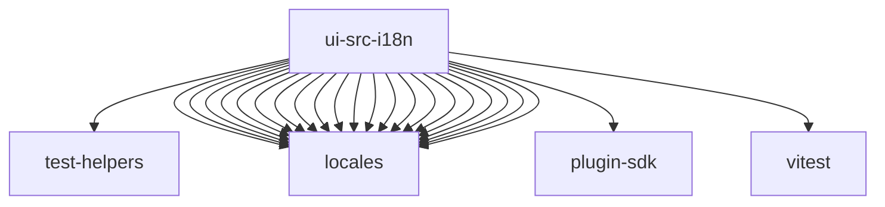

# Imports

[← Back to MODULE](MODULE.md) | [← Back to INDEX](../../INDEX.md)

## Dependency Graph

## External Dependencies

Dependencies from other modules:

- `../../test-helpers/storage.ts`
- `../locales/ar.ts`
- `../locales/de.ts`
- `../locales/en.ts`
- `../locales/es.ts`
- `../locales/fa.ts`
- `../locales/fr.ts`
- `../locales/hi.ts`
- `../locales/id.ts`
- `../locales/it.ts`
- `../locales/ja-JP.ts`
- `../locales/ko.ts`
- `../locales/nl.ts`
- `../locales/pl.ts`
- `../locales/pt-BR.ts`
- `../locales/ru.ts`
- `../locales/th.ts`
- `../locales/tr.ts`
- `../locales/uk.ts`
- `../locales/vi.ts`
- `../locales/zh-CN.ts`
- `../locales/zh-TW.ts`
- `openclaw/plugin-sdk/test-fixtures`
- `vitest`
