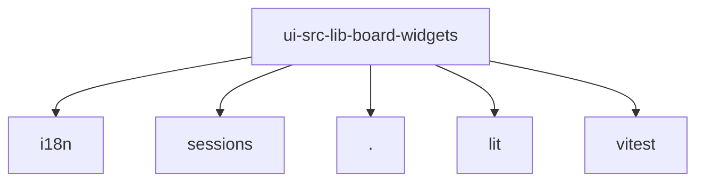

# Imports

[← Back to MODULE](MODULE.md) | [← Back to INDEX](../../INDEX.md)

## Dependency Graph

## External Dependencies

Dependencies from other modules:

- `../../../i18n/index.ts`
- `../../sessions/session-key.ts`
- `./swarm.ts`
- `lit`
- `vitest`
