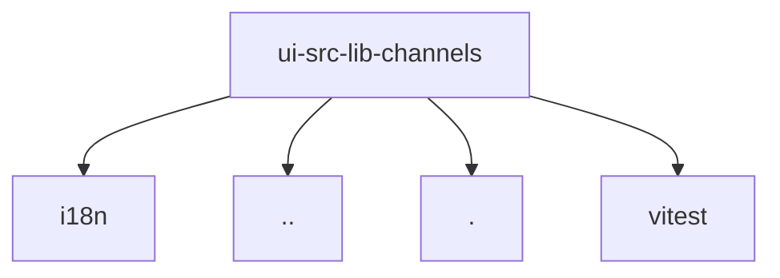

# Module: ui/src/lib/channels

[← Back to INDEX](../../INDEX.md)

**Type:** js/ts | **Files:** 2

**Entry point:** `ui/src/lib/channels/index.ts`

## Files

| File | Lines | Large |
| ---- | ----- | ----- |
| `ui/src/lib/channels/index.test.ts` | 266 |  |
| `ui/src/lib/channels/index.ts` | 435 |  |

---

## External Dependencies

Dependencies from other modules:

- `../../i18n/index.ts`
- `../gateway-errors.ts`
- `./index.ts`
- `vitest`
