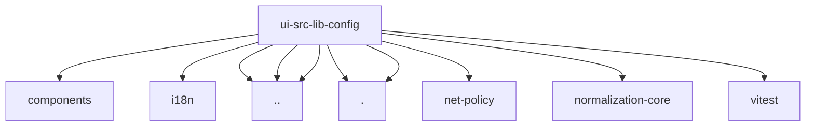

# Imports

[← Back to MODULE](MODULE.md) | [← Back to INDEX](../../INDEX.md)

## Dependency Graph

## External Dependencies

Dependencies from other modules:

- `../../components/config-form.shared.ts`
- `../../i18n/index.ts`
- `../clipboard.ts`
- `../config-form-utils.ts`
- `../json5-runtime.ts`
- `./applied-refresh.ts`
- `./index.ts`
- `@openclaw/net-policy/redact-sensitive-url`
- `@openclaw/normalization-core/record-coerce`
- `vitest`
