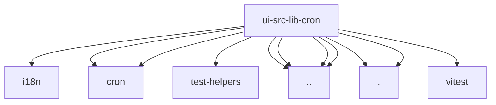

# Imports

[← Back to MODULE](MODULE.md) | [← Back to INDEX](../../INDEX.md)

## Dependency Graph

## External Dependencies

Dependencies from other modules:

- `../../i18n/index.ts`
- `../../lib/cron/decimal.ts`
- `../../lib/cron/index.ts`
- `../../test-helpers/cron.ts`
- `../cron-status.ts`
- `../format.ts`
- `../gateway-errors.ts`
- `../string-coerce.ts`
- `./decimal.ts`
- `./scope.ts`
- `vitest`
