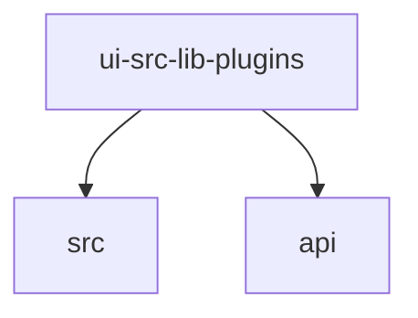

# Module: ui/src/lib/plugins

[← Back to INDEX](../../INDEX.md)

**Type:** js/ts | **Files:** 1

**Entry point:** `ui/src/lib/plugins/index.ts`

## Files

| File | Lines | Large |
| ---- | ----- | ----- |
| `ui/src/lib/plugins/index.ts` | 73 |  |

---

## External Dependencies

Dependencies from other modules:

- `../../../../packages/gateway-protocol/src/clawhub-trust-error-details.js`
- `../../api/gateway.ts`
