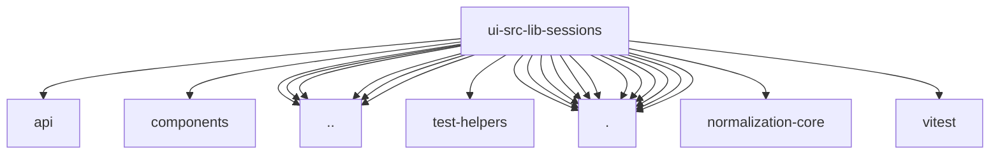

# Imports

[← Back to MODULE](MODULE.md) | [← Back to INDEX](../../INDEX.md)

## Dependency Graph

## External Dependencies

Dependencies from other modules:

- `../../api/gateway.ts`
- `../../components/panel-toggle-contract.ts`
- `../../local-storage.ts`
- `../../test-helpers/wait-for.ts`
- `../format.ts`
- `../gateway-methods.ts`
- `../session-display.ts`
- `../session-run-state.ts`
- `../string-coerce.ts`
- `./catalog-key.ts`
- `./catalog-project-grouping.ts`
- `./create.ts`
- `./custom-groups.ts`
- `./grouping.ts`
- `./index.ts`
- `./navigation.ts`
- `./reconcile.ts`
- `./session-key.ts`
- `./swarm-activity.ts`
- `./unread.ts`
- `./usage.ts`
- `@openclaw/normalization-core/record-coerce`
- `vitest`
