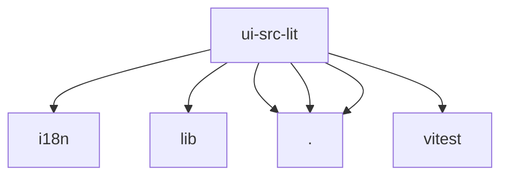

# Imports

[← Back to MODULE](MODULE.md) | [← Back to INDEX](../../INDEX.md)

## Dependency Graph

## Internal Dependencies

Dependencies within this module:

- `lit`

## External Dependencies

Dependencies from other modules:

- `../i18n/index.ts`
- `../i18n/lib/lit-controller.ts`
- `./openclaw-element.ts`
- `./poll-controller.ts`
- `./subscriptions-controller.ts`
- `vitest`
