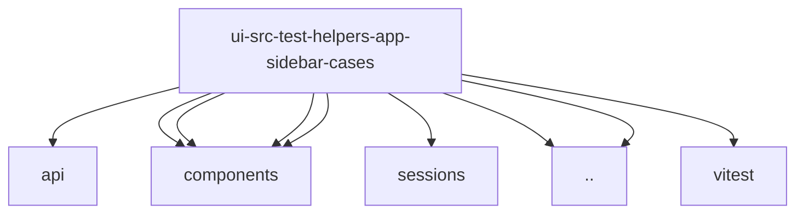

# Imports

[← Back to MODULE](MODULE.md) | [← Back to INDEX](../../INDEX.md)

## Dependency Graph

## External Dependencies

Dependencies from other modules:

- `../../api/gateway.ts`
- `../../components/app-sidebar-session-catalog-live.ts`
- `../../components/app-sidebar.ts`
- `../../components/lobster-pet.ts`
- `../../components/panel-toggle-contract.ts`
- `../../lib/sessions/catalog-key.ts`
- `../app-sidebar.ts`
- `../wait-for.ts`
- `vitest`
